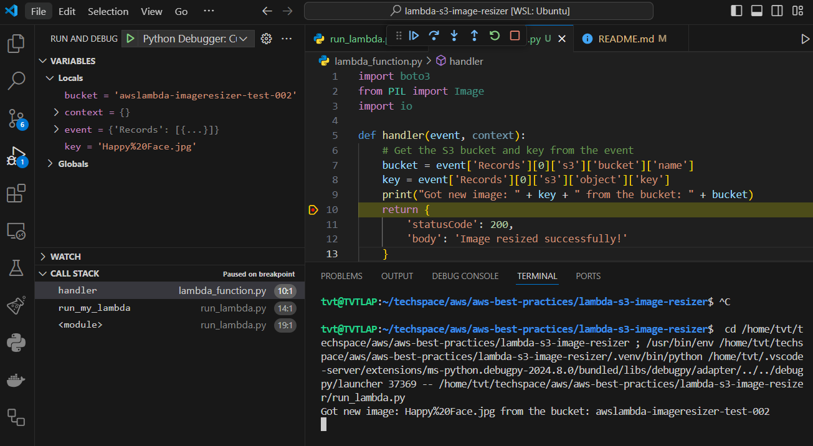

# Using Python and AWS Lambda to Resize Images


# Verify using Python 3.10

In our example, it requires to use Python 3.10. By using [PYENV for managing Python versions](https://github.com/pyenv/pyenv), we can easy to switch multiple Python versions. Follow this [How to Install Pyenv on Ubuntu 22.04](https://tuts.heomi.net/how-to-install-pyenv-on-ubuntu-22-04/).


Check installed python versions
```sh
$ pyenv versions
  system
  3.7.17
* 3.9.19 (set by /home/tvt/.pyenv/version)
  3.12.4
```

Check current Python version
```sh
$ python --version
Python 3.9.19
```

Check available python versions
```sh
$ pyenv install -l
```

Install the latest verions of Python 3.10 series
```sh
$ pyenv install 3.10.14
Downloading Python-3.10.14.tar.xz...
-> https://www.python.org/ftp/python/3.10.14/Python-3.10.14.tar.xz
Installing Python-3.10.14...
Installed Python-3.10.14 to /home/tvt/.pyenv/versions/3.10.14
```

Switch to use the Python 3.10.14
```sh
$ pyenv global 3.10.14
$ pyenv versions
  system
  3.7.17
  3.9.19
* 3.10.14 (set by /home/tvt/.pyenv/version)
  3.12.4
```

Verify correct version 3.10.14
```sh
$ python --version
Python 3.10.14
$ python3 --version
Python 3.10.14
```

If you are using VS Code, you have to [select the environment](https://code.visualstudio.com/docs/python/environments) using the `Python: Select interpreter` command to select the correct interpreter path:


Then you need to re-open the terminal and verify Python version again


# Setting up the AWS environment

## Create an S3 bucket

Let's create the bucket that will be used to upload user images

The following command creates a bucket named `awslambda-imageresizer-test-002` in the `us-west-2` region. Regions outside of `us-east-1` require the appropriate `LocationConstraint` to be specified in order to create the bucket in the desired region.

```bash
$ aws s3api --profile tvt_admin create-bucket \
    --bucket awslambda-imageresizer-test-002 \
    --region us-west-2 \
    --create-bucket-configuration "LocationConstraint=us-west-2"

{
    "Location": "http://awslambda-imageresizer-test-002.s3.amazonaws.com/"
}
```

To verify the bucket created
```bash
$ aws s3api head-bucket --bucket "awslambda-imageresizer-test-002" --profile tvt_admin
{
    "BucketRegion": "us-west-2",
    "AccessPointAlias": false
}
```

Or can use the list command with query by bucket name
```bash
$ aws s3api list-buckets --query 'Buckets[?Name==`awslambda-imageresizer-test-002`]' --output text --profile tvt_admin

2024-07-24T04:05:49+00:00       awslambda-imageresizer-test-002
```


## Create an IAM role

Creating a role and providing permission to the Lambda service assume this role
```sh
$ aws iam create-role --profile tvt_admin \
    --role-name awslambda-imageresizer-role \
    --assume-role-policy-document \
'{
  "Version": "2012-10-17",
  "Statement": [
  {
    "Effect": "Allow", 
    "Principal": {
      "Service": "lambda.amazonaws.com"
     }, 
     "Action": "sts:AssumeRole"
   }
  ]
}'


{
    "Role": {
        "Path": "/",
        "RoleName": "awslambda-imageresizer-role",
        "RoleId": "AROAW5R5WNQHPIUROBQUX",
        "Arn": "arn:aws:iam::475797023758:role/awslambda-imageresizer-role",
        "CreateDate": "2024-07-24T04:22:24+00:00",
        "AssumeRolePolicyDocument": {
            "Version": "2012-10-17",
            "Statement": [
                {
                    "Effect": "Allow",
                    "Principal": {
                        "Service": "lambda.amazonaws.com"
                    },
                    "Action": "sts:AssumeRole"
                }
            ]
        }
    }
}
```

Let's add the [AWSLambdaBasicExecutionRole](https://docs.aws.amazon.com/aws-managed-policy/latest/reference/AWSLambdaBasicExecutionRole.html) policy. It provides write permissions to CloudWatch Logs.
```sh
$ aws iam attach-role-policy --profile tvt_admin \
    --role-name awslambda-imageresizer-role \
    --policy-arn arn:aws:iam::aws:policy/service-role/AWSLambdaBasicExecutionRole
```

To check created role information
```bash
$ aws iam get-role --profile tvt_admin \
    --role-name awslambda-imageresizer-role
{
    "Role": {
        "Path": "/",
        "RoleName": "awslambda-imageresizer-role",
        "RoleId": "AROAW5R5WNQHPIUROBQUX",
        "Arn": "arn:aws:iam::475797023758:role/awslambda-imageresizer-role",
        "CreateDate": "2024-07-24T04:22:24+00:00",
        "AssumeRolePolicyDocument": {
            "Version": "2012-10-17",
            "Statement": [
                {
                    "Effect": "Allow",
                    "Principal": {
                        "Service": "lambda.amazonaws.com"
                    },
                    "Action": "sts:AssumeRole"
                }
            ]
        },
        "MaxSessionDuration": 3600,
        "RoleLastUsed": {}
    }
}
```


To check all policies of specific role
```bash
$ aws iam list-role-policies --profile tvt_admin \
    --role-name awslambda-imageresizer-role
```
To get all attached policies
```bash
$ aws iam list-attached-role-policies --profile tvt_admin \
    --role-name awslambda-imageresizer-role
{
    "AttachedPolicies": [
        {
            "PolicyName": "AWSLambdaBasicExecutionRole",
            "PolicyArn": "arn:aws:iam::aws:policy/service-role/AWSLambdaBasicExecutionRole"
        }
    ]
}
```


# Setting up the Environment

Create `requirements.txt` contains the libraries
* `boto3`: connect to S3, open image from S3 bucket, upload the resized image to S3 bucket
* `Pillow`:  resize image
```sh
$ cat requirements.txt 

boto3
Pillow
```

Create a new virtual environment (https://packaging.python.org/en/latest/guides/installing-using-pip-and-virtual-environments/)
```sh
$ python3 -m venv .venv

[notice] A new release of pip is available: 23.0.1 -> 24.1.2
[notice] To update, run: pip install --upgrade pip
```

Activate a virtual environment
```sh
$ source .venv/bin/activate
```

To confirm the virtual environment is activated, check the location of your Python interpreter:
```sh
$ which python
...
.venv/bin/python
```

Deactivate a virtual environment
```sh
$ deactivate
```

Prepare pip: You can make sure that pip is up-to-date by running:
```sh
$ python3 -m pip install --upgrade pip
$ python3 -m pip --version
pip 24.1.2 from /home/tvt/techspace/aws/aws-best-practices/lambda-s3-image-resizer/.venv/lib/python3.10/site-packages/pip (python 3.10)
```

You can Install packages using pip
```sh
$ python3 -m pip install boto3
$ python3 -m pip install Pillow
```

Or if you already declare all dependencies in a `requirements.txt` file, you can install all of the packages in this file using `-r` flag:
```sh
$ python3 -m pip install -r requirements.txt
```

Freezing dependencies: Pip can export a list of all installed packages and their versions using the freeze command:
```sh
$ python3 -m pip freeze
```

# Prepare for Debuging and Testing

If you are using VS Code, make sure the environment you want to use is selected in the Python extension for VS Code by running the [Select Interpreter](https://code.visualstudio.com/docs/python/environments) command or via the status bar. Otherwise you can explicitly [set the Python interpreter to be used when debugging](https://code.visualstudio.com/docs/python/debugging#_python) via the python setting for your debug config

Menubar -> View -> Command Palette -> Python: Select Interpreter


Create a file [lambda_function.py](lambda_function.py) with the minimum codes for testing first
```python
import boto3
from PIL import Image
import io

def handler(event, context):
    # Get the S3 bucket and key from the event
    bucket = event['Records'][0]['s3']['bucket']['name']
    key = event['Records'][0]['s3']['object']['key']
    print("Got new image: " + key + " from the bucket: " + bucket)
    return {
        'statusCode': 200,
        'body': 'Image resized successfully!'
    }
```

Create a file [run_lambda.py](./run_lambda.py) for debuging and testing my lambda code
```python
import os
import json

import logging
logging.basicConfig(level=logging.INFO)

import lambda_function as my_lambda

def run_my_lambda():
    # To escape JSON for fixtures
    # https://www.freeformatter.com/json-escape.html
    with open('./tests/fixtures/lambda_events/s3-object-created-put-event.json') as json_file:
        data = json.load(json_file)
        response = my_lambda.handler(event=data, context={})
        print(response)


if __name__ == '__main__':    
    run_my_lambda()
```

This program will read the [S3 ObjectCreated::Put] event from the fixture file: [s3-object-created-put-event.json](./tests/fixtures/lambda_events/s3-object-created-put-event.json) and pass the data to lamdbda handler function.


In VSCode, you need to install the Python Debugger extension. Then configure the launch.json file
```json
{
    // Use IntelliSense to learn about possible attributes.
    // Hover to view descriptions of existing attributes.
    // For more information, visit: https://go.microsoft.com/fwlink/?linkid=830387
    "version": "0.2.0",
    "configurations": [
        {
            "name": "Python Debugger: Current File",
            "type": "debugpy",
            "request": "launch",
            "program": "${file}",
            "console": "integratedTerminal"
        }
    ]
}
```

Finally, open the file `run_lambda.py`, then cho RUN AND DEBUG with configuration: `Python Debugger: Current File`



# Complete Lambda Process

We are parsing the uploaded image details from the event.

Using boto3, we are open the image and resize it using the Pillow library. 

Finally using boto3 to upload the resized image with a 'resized-' prefix attached.

```python
import boto3
from PIL import Image
import io

def handler(event, context):
    # Get the S3 bucket and key from the event
    bucket = event['Records'][0]['s3']['bucket']['name']
    key = event['Records'][0]['s3']['object']['key']
    print("Got new image: " + key + " from the bucket: " + bucket)

    # Set the desired width and height for resizing
    width = 800
    height = 600

    # Load the image from S3
    s3 = boto3.client('s3')
    response = s3.get_object(Bucket=bucket, Key=key)
    image = Image.open(io.BytesIO(response['Body'].read()))

    # Resize the image
    resized_image = image.resize((width, height))
    print("Image resized.")

    # Save the resized image to the same S3 bucket with a different name
    resized_key = 'resized-' + key
    with io.BytesIO() as output:
        resized_image.save(output, format='JPEG')
        output.seek(0)
        s3.put_object(Body=output, Bucket=bucket, Key=resized_key)

    print("Image " + resized_key + " uploaded.")
    return {
        'statusCode': 200,
        'body': 'Image resized successfully!'
    }
```

# Testing Lambda code with LocalStack

First pull LocalStack image
```sh
$ docker pull localstack/localstack
```

Ensure Ensure Python 3.10 is installed
```sh
$ pyenv versions
$ pyenv global 3.10.14
$ python --version
```

Next, we need to install `localstack` and `awscli-local` packages to use them with Docker container
```sh
$ pip install --upgrade localstack
$ pip install awscli-local
```

The final step is to run our Docker container, attaching the Docker socket. This is required for Lambda functions and other services that necessitate opening additional containers.
```sh
$ docker run \
  --rm -it \
  -p 4566:4566 \
  -p 4510-4559:4510-4559 \
  -v /var/run/docker.sock:/var/run/docker.sock \
  localstack/localstack
```

LocalStack should be started at `http://localhost:4566` or `https://localhost.localstack.cloud:4566`. To check it’s running properly, check the health by visiting `{endpoint}/_localstack/health`.
```sh
$ curl --silent https://localhost.localstack.cloud:4566/_localstack/health | jq

{
  "services": {
    "acm": "available",
    "apigateway": "available",
    "cloudformation": "available",
    "cloudwatch": "available",
    "config": "available",
    "dynamodb": "available",
    "dynamodbstreams": "available",
    "ec2": "available",
    "es": "available",
    "events": "available",
    "firehose": "available",
    "iam": "available",
    "kinesis": "available",
    "kms": "available",
    "lambda": "available",
    "logs": "available",
    "opensearch": "available",
    "redshift": "available",
    "resource-groups": "available",
    "resourcegroupstaggingapi": "available",
    "route53": "available",
    "route53resolver": "available",
    "s3": "running",
    "s3control": "available",
    "scheduler": "available",
    "secretsmanager": "available",
    "ses": "available",
    "sns": "available",
    "sqs": "available",
    "ssm": "available",
    "stepfunctions": "available",
    "sts": "available",
    "support": "available",
    "swf": "available",
    "transcribe": "available"
  },
  "edition": "community",
  "version": "3.5.1.dev"
}
```

List all S3 buckets to verify that everything is working correctly
```sh
$ awslocal s3api list-buckets
{
    "Buckets": [],
    "Owner": {
        "DisplayName": "webfile",
        "ID": "75aa57f09aa0c8caeab4f8c24e99d10f8e7faeebf76c078efc7c6caea54ba06a"
    }
}
```

Create S3 bucket for holding image and the resized image
```sh
$ awslocal s3 mb s3://awslambda-imageresizer-test-002 --region us-west-2
make_bucket: awslambda-imageresizer-test-002
```

List S3 bucket again for verifing S3 bucket created
```sh
$ awslocal s3api list-buckets

{
    "Buckets": [
        {
            "Name": "awslambda-imageresizer-test-002",
            "CreationDate": "2024-07-24T09:03:46+00:00"
        }
    ],
    "Owner": {
        "DisplayName": "webfile",
        "ID": "75aa57f09aa0c8caeab4f8c24e99d10f8e7faeebf76c078efc7c6caea54ba06a"
    }
}
```

We can now push the sample image file to the bucket
```sh
$ cd ~/techspace/aws/aws-best-practices/lambda-s3-image-resizer
$ awslocal \
s3api put-object --bucket awslambda-imageresizer-test-002 \
--key happy-smiley-face.jpg --body=happy-smiley-face.jpg

{
    "ETag": "\"7c78efd6e95d7e1928ee34fa25fb5eb1\"",
    "ServerSideEncryption": "AES256"
}
```

Check S3 bucket to verify the image file has been uploaded:
```sh
$ awslocal s3api list-objects --bucket awslambda-imageresizer-test-002 --query 'Contents[].{Key: Key, Size: Size}'

[
    {
        "Key": "happy-smiley-face.jpg",
        "Size": 181915
    }
]
```

If we don't want to use the `awslocal` CLI, you can specify the endpoint of LocalStack:
```sh
$ aws s3api list-objects --endpoint-url=http://localhost:4566 --bucket awslambda-imageresizer-test-002 --query 'Contents[].{Key: Key, Size: Size}'
[
    {
        "Key": "happy-smiley-face.jpg",
        "Size": 181915
    }
]
```

We also can create a profile to access LocalStack
```sh
$ cat ~/.aws/config

[profile localstack]
output = json
region = us-east-1
endpoint_url = https://localhost.localstack.cloud:4566
```

Then we can using this profile for the CLI:
```sh
$ aws s3api list-objects --profile localstack --bucket awslambda-imageresizer-test-002 --query 'Contents[].{Key: Key, Size: Size}'
[
    {
        "Key": "happy-smiley-face.jpg",
        "Size": 181915
    }
]
```

Now update the file `run_lambda.py` to allow access LocalStack by using profile
```python
import boto3
boto3.setup_default_session(profile_name='localstack')
```

Run test lambda by command
```sh
$ python3 run_lambda.py
Got new image: happy-smiley-face.jpg from the bucket: awslambda-imageresizer-test-002
INFO:botocore.credentials:Found credentials in shared credentials file: ~/.aws/credentials
INFO:botocore.configprovider:Found endpoint for s3 via: config_global.
Image resized.
Image resized-happy-smiley-face.jpg uploaded.
{'statusCode': 200, 'body': 'Image resized successfully!'}
```

Re-check the S3 bucket to see the new resized file has been uploaded:
```sh
$  aws s3api list-objects --profile localstack --bucket awslambda-imageresizer-test-002 --query 'Contents[].{Key: Key, Size: Size}'
[
    {
        "Key": "happy-smiley-face.jpg",
        "Size": 181915
    },
    {
        "Key": "resized-happy-smiley-face.jpg",
        "Size": 73688
    }
]
```

We can download the resized file
```sh
$ wget http://localhost:4566/awslambda-imageresizer-test-002/resized-happy-smiley-face.jpg
```